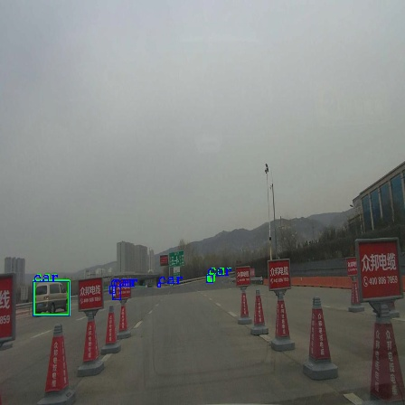
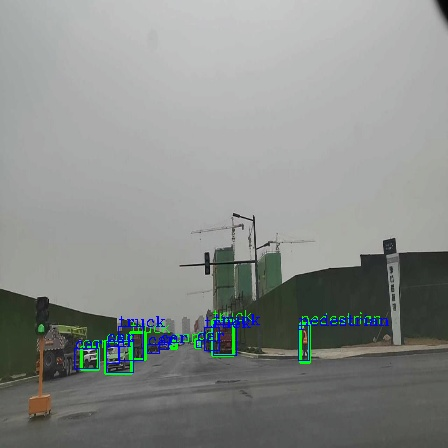
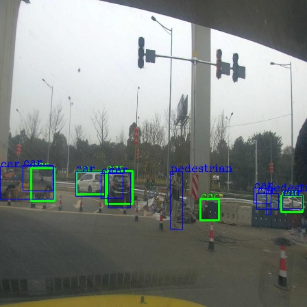
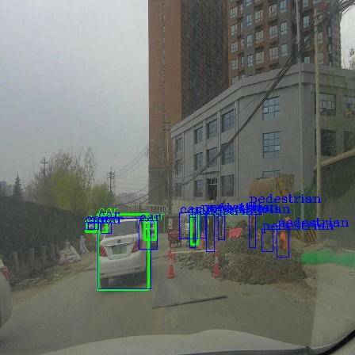
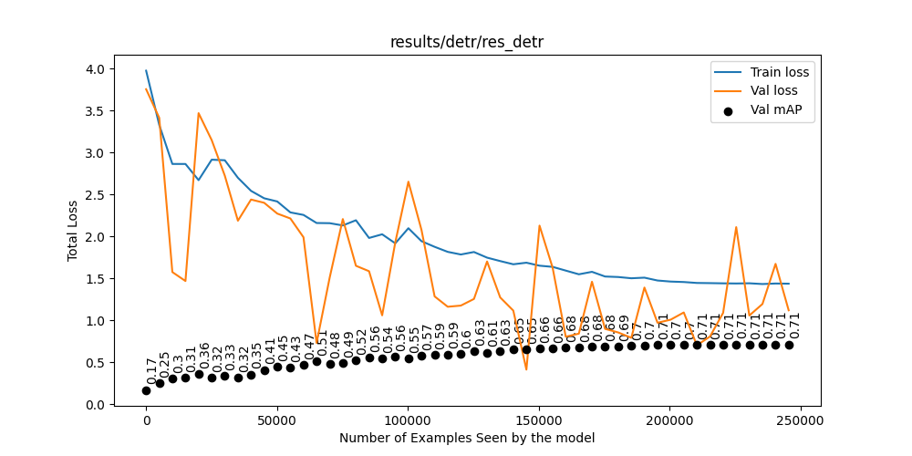
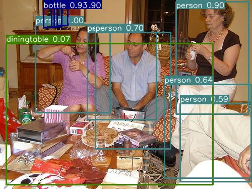
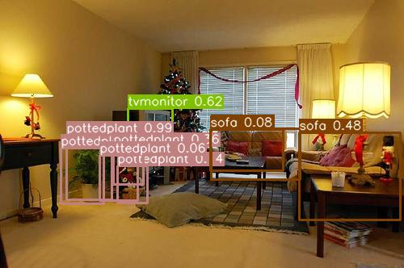
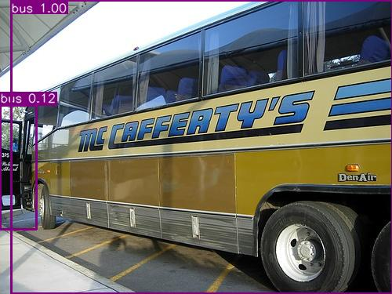
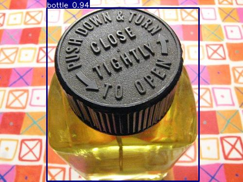

#### a1. Classification/Recognition
Classification of real and fake images.
#### a2. Semantic Segmentation
Multi-class image segmentation.
#### a3. Object Detection (CenterNet)
- ##### Dataset
    Download data by following the instructions from: [CODA](https://coda-dataset.github.io/download.html).
- ##### Model
    CenterNet (ResNet50 backbone).
- ##### Training
    - num_epochs: 150.
    - Optimizer: Adam.
    - lr: 1e-3, weight_decay: 0.001.
- ##### Results
<!-- Predicted Test Images -->
<p align="center">
  <strong>Predicted Test Images</strong>
</p>
<p align="center">
  
  
  
  
</p>

#### a4. Object Detection (DETR)
- ##### Dataset
    Pascal VOC 2007 object detection dataset.
    ```
    bash download_data.sh data/
    ```
- ##### Model
    Simplified DETR (Dinov2 backbone).
- ##### Training
    - num_epochs: 50.
    - Backbone learning rate: 1e-05.
    - Head learning rate: 0.0001.
    - Finished training in 17890.0s.
    - Final test mAP: 0.7116.
    - Final test loss: 1.4354.
    </br>
    <!-- Training Loss curves -->
    <p align="center">
    <strong>Training Loss Curves</strong>
    </p>
    <p align="center">
    
    </p>
- ##### Results
<!-- Predicted Test Images -->
<p align="center">
  <strong>Predicted Test Images</strong>
</p>
<p align="center">
  
  
  
  
</p>